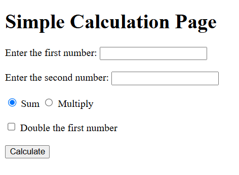
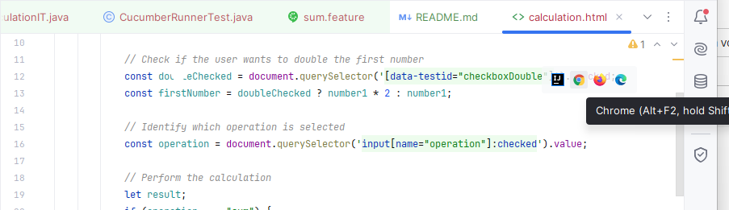
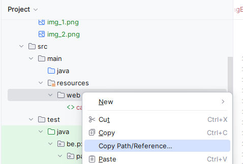

## Demo project

Dit project bevat een html-pagina met de volgende functionaliteit:

De gebruiker kan:

- Twee getallen invoeren
- Optioneel kiezen om het eerste getal te verdubbelen via een checkbox
- Kiezen tussen optellen (sum) of vermenigvuldigen (multiply)

Na het klikken op Calculate-knop wordt het resultaat getoond in de pagina.


Deze web-pagina vind je in de folder src/main/resources/web/calculation.html.
Je kan deze pagina open in de browser door op het icoontje in de rechter bovenhoek te klikken.



Verder bevat het project testen geschreven in Playwright om de beschreven functionaliteit te testen.
Daarnaast wordt ook Cucumber in het project geïntegreerd.

### Testen uitvoeren

Om de testen uit te voeren moet je de systeem eigenschap (system property) base.url gebruiken.
Dit is het volledige, absolute path naar de web folder (src/main/resources/web). 



Het maven commando om de testen uit te voeren is: 

```
mvn clean verify -D base.url="C:\Users\<path_to_project>\src\main\resources\web\"
```
of 
```
mvn clean verify -Dbase.url="<path_to_project>\src\main\resources\web\"
```

### Opdracht

Los de vragen op blackboard op.
